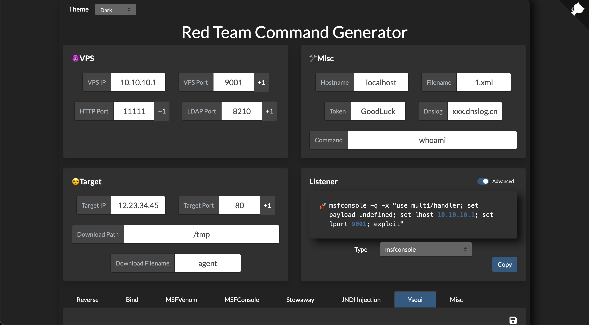
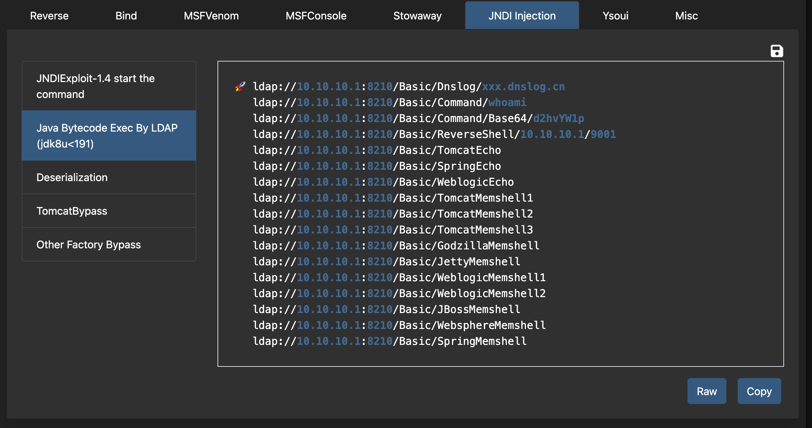

# Red-Team-Command-Generator

红队命令生成器，由https://github.com/0dayCTF/reverse-shell-generator 项目改造而来。

输入固定的参数，可以方便的生成各种常用命令

在线地址：https://redteamcmdgenerate.netlify.app/

可生成常用的msf payload以及监听命令、stowaway的服务端和客户端启动命令、JNDI Exploit的启动和payload等等

